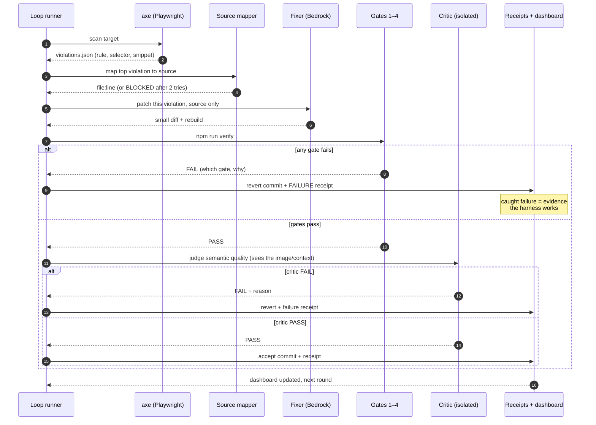
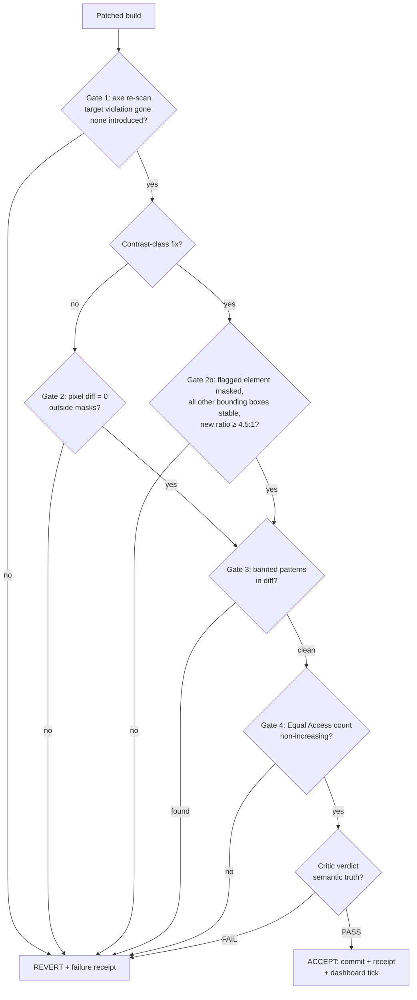

# Mend architecture

Three lanes: ACT (find and patch), VERIFY (four gates plus critic), PROVE
(receipts, dashboard, deploy). The fixer never grades its own homework and the
gates cannot be argued with.

## 1. System overview

```mermaid
flowchart LR
    subgraph RUN["Loop runner (loop.sh → Claude Code, Bedrock)"]
        direction TB
        T[TASKS.md + JOURNAL.md<br/>state in git]
    end

    subgraph ACT["ACT"]
        direction TB
        S[axe-core scan<br/>Playwright] --> M[Source mapper<br/>DOM node → file:line]
        M --> F[Fixer agent<br/>Claude on Bedrock<br/>patches SOURCE only]
    end

    subgraph TGT["Patient"]
        P[Target site<br/>behind Pomerium policy<br/>agent holds no credentials]
    end

    subgraph VERIFY["VERIFY — all gates must pass"]
        direction TB
        G1[Gate 1<br/>axe re-scan:<br/>violation gone] --> G2[Gate 2<br/>pixel diff vs baseline<br/>masked + frozen]
        G2 --> G3[Gate 3<br/>banned-pattern check<br/>no suppression]
        G3 --> G4[Gate 4<br/>IBM Equal Access<br/>independent engine]
        G4 --> C[Critic agent<br/>isolated context<br/>judges alt text truth,<br/>label meaning]
    end

    subgraph PROVE["PROVE"]
        direction TB
        R[Receipt per fix<br/>before/after + diffs + verdicts]
        D[Live dashboard<br/>WebSocket counter + gate lights]
        Z[Zero deploy<br/>agent ships healed site<br/>to shareable link]
    end

    RUN --> S
    S -->|renders| P
    F -->|rebuild| P
    F --> G1
    C -->|PASS| R
    C -->|FAIL| REV[Auto-revert<br/>+ failure receipt]
    REV --> R
    R --> D
    R --> Z
```

## 2. One round, as a sequence

## 3. Gate logic (including the contrast special case)

## Component contracts

- mapper(violation) → {file, lineStart, lineEnd, confidence} | BLOCKED. Confidence
  below threshold routes to strategy 3 (build-time data-mend-src annotations).
- verify() → {pass, gates: [{name, pass, detail}]}. Fail-fast, but always record
  which gate. Machine-readable json + one human line per gate.
- receipt schema: docs/RUBRIC.md section 6. Written on accept AND revert.
- Dashboard consumes runs/ + receipts/ over ws; it renders state, it never owns it.
- Pomerium sits between Playwright and the served target. Its access log joins the
  evidence trail: every page touched, identity-checked, policy-scoped.
- Zero runs once, at loop end, as the agent's own final act: deploy healed build,
  return shareable URL, write it into the final receipt.
